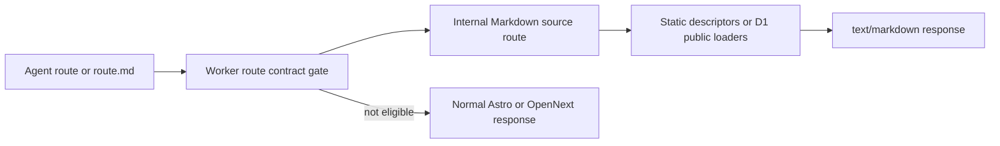

## Context

Karte combines an Astro landing overlay, Next/OpenNext static pages, and
D1-backed public profiles. The current sitemap is maintained separately from
the Astro overlay and agent-edge payload, includes non-HTML machine files, and
does not distinguish enabled profile modes from modes with ready public
content. Only the homepage currently negotiates Markdown.

The indexable HTML inventory is:

- seven static routes: `/`, `/about`, `/create`, `/faq`, `/changelog`,
  `/privacy`, and `/terms`;
- one root route for each published profile;
- enabled profile mode routes only when their generated content is ready:
  `encyclopedia`, `newspaper`, and `roast`.

Login, welcome, dashboard routes, APIs, JSON manifests, vCards, and agent
discovery files remain useful but are not public HTML documents.

## Goals / Non-Goals

**Goals:**

- Generate sitemap entries and Markdown eligibility from one shared route
  contract.
- Render Markdown from the same static descriptors and D1 profile loaders used
  by human pages.
- Give every indexed HTML route a self-canonical URL and complete social
  metadata.
- Preserve the Astro landing fast path and Karte's agent-native skill/API
  surfaces.
- Fail closed for unpublished profiles, unready modes, private/auth routes, and
  non-HTML resources.

**Non-Goals:**

- Indexing dashboard, authentication, onboarding, JSON, API, or download
  routes.
- Changing profile visibility, generated-content schemas, database schema, or
  visual design.
- Deploying, migrating, or adding a production dependency.

## Decisions

### Use a portable public-route contract

A dependency-free root module will define the seven static route descriptors,
reserved path segments, profile mode definitions, Markdown path mapping, and
the function that derives ready mode paths. The Next sitemap, metadata helpers,
Astro pages, edge Markdown gate, and coverage tests consume this contract.

Keeping route truth in page files was rejected because Astro, Next, and the
Worker would continue to drift. A generated file was rejected because runtime
D1 readiness still has to be evaluated dynamically.

### Render dynamic Markdown through an internal OpenNext source route

The Worker recognizes Markdown negotiation and `.md` alternates before normal
routing. It calls an internal Next route that uses `getFullPageData` and
`getGeneratedPage`, then formats only public source objects. It never converts
streamed React HTML and never externally refetches Karte.

### Keep only HTML documents in the sitemap

The sitemap contains the seven static HTML routes plus published profile roots
and ready enabled modes. `skill.md`, `llms.txt`, `index.md`, `agent.json`,
`data.json`, and vCards remain directly discoverable through the agent catalog
or page links but are not mislabeled as HTML search documents.

The `/api/ai` catalog will list bounded HTML surfaces with real Markdown
targets. Agent-native machine surfaces remain in their dedicated top-level
fields and skill documents.

### Share metadata builders across Next route families

Static descriptors supply canonical title/description values. A metadata helper
adds self-canonical URLs, Open Graph URL/image, and Twitter cards. Dynamic
profiles and ready modes use the same helper with source-backed names and
descriptions. The Astro layout uses its canonical path for both canonical and
Open Graph URL.

## Risks / Trade-offs

- **A new route could bypass the contract** → Full sitemap/Markdown tests fail
  when a route is uncovered, and reserved-path tests protect private families.
- **D1 is unavailable during build** → The sitemap keeps the seven static
  routes and catches the dynamic query failure, matching existing behavior.
- **Generated HTML varies in shape** → The source renderer handles only
  normalized encyclopedia, roast, and newspaper schemas and fails explicitly
  for missing/unready content.
- **Astro overlay pages can be shadowed by the Next catch-all** → The Worker
  explicitly serves the three Astro-owned HTML paths from the asset binding
  before OpenNext.
- **Markdown adds dynamic read cost** → Successful responses use the same
  short public profile cache window and edge-cache directives.

## Migration Plan

No schema migration is required. Ship code as one reversible Worker change;
rollback restores the previous sitemap and agent boundary. Production
deployment remains manual and outside this change.

## Open Questions

None.
