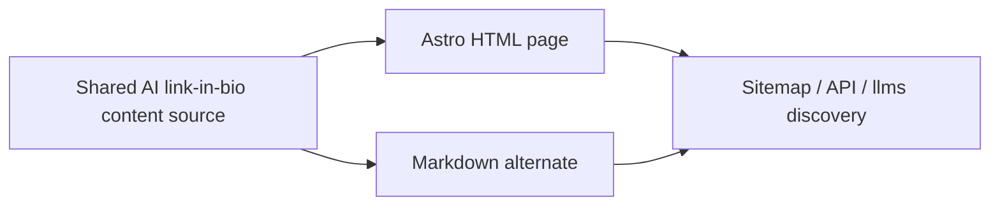

## Context

Karte already has a portable public-route contract spanning Astro HTML,
OpenNext Markdown negotiation, the sitemap, and agent discovery. The new page
must extend this contract without duplicating copy across renderers or scraping
generated HTML. Karte's established Onyx dark-and-gold content-page language is
the visual authority; this is a preserve-mode, Read surface.

## Goals and Non-Goals

**Goals**

- Keep all substantive page copy, metadata, FAQs, sources, and Markdown in one
  shared content module.
- Render a canonical Astro page and substantive Markdown from that module.
- Register one route consistently across sitemap, `/api/ai`, llms indexes, and
  edge fallbacks.
- Make the comparison, limitations, sources, FAQ, and one primary CTA useful
  without JavaScript.

**Non-goals**

- No new product capability, identity verification, data model, authentication
  path, agent behavior, or dependency.
- No redesign of Karte's established visual system and no primary-navigation,
  analytics, legal-copy, or wordmark changes.
- No syndicated or third-party copy of this page.

## Architecture

`content-pages/ai-link-in-bio.mjs` is the sole content and metadata source. The
Astro route imports it for visible sections, FAQ content, sources, internal
links, and JSON-LD. The public-route contract imports its route descriptor; the
Markdown renderer imports its authored Markdown directly. Edge fallback files
use the same route identity so source and built output remain aligned.

`worker.mjs` must add `/ai-link-in-bio` to both `CACHEABLE_EXACT` and
`ASTRO_ASSET_PATHS`. This is an explicit production-routing boundary: without
both entries, the custom Worker can bypass the overlaid Astro document and let
OpenNext interpret `ai-link-in-bio` as a dynamic profile slug. A source-level
regression check keeps those allowlists aligned with the public route contract.

## Content Ownership and Cannibalization

The new page owns category/workflow evaluation: what an AI link-in-bio is, how
it differs from a conventional link page, who it serves, supported questions,
trust-card limits, public/private boundaries, and creation steps. `/faq` stays
the compact long-tail question reference and links to the deeper guide. The
homepage adds only one discovery link and does not duplicate the guide.

## Visual and Accessibility Contract

The surface extends the Onyx content-page world from `faq.astro`, `Layout.astro`,
and `landing.css`: restrained gold accents, readable bounded prose, existing
type and spacing tokens, visible focus, semantic landmarks/headings, and
reduced-motion behavior. The first viewport gives the concise comparison,
audience/fit boundary, and a visually primary “Draft your profile” CTA. The
comparison table must remain readable without horizontal page overflow at 390,
768, and 1440 pixels.

## Claims and Failure Boundaries

- Visible content must state that AI answers may be inaccurate and that public
  declarations are not verification.
- FAQPage answers must match visible answers; JSON-LD must not introduce hidden
  claims.
- If the shared source is missing or malformed, tests/builds fail rather than
  serving a thin page or HTML shell as Markdown.
- Private, authenticated, JSON, and machine-only paths remain outside the HTML
  sitemap and public Markdown route boundary.

## Deployment

Merge only after strict OpenSpec, targeted route and Worker-routing tests, Astro build, lint,
typecheck, docs check, full tests, Cloudflare build, design receipt, and diff
checks pass. Dispatch the existing deploy workflow manually from `main`; the
workflow checkout SHA and 100%-traffic Worker version tag must equal the merged
40-character main revision.
